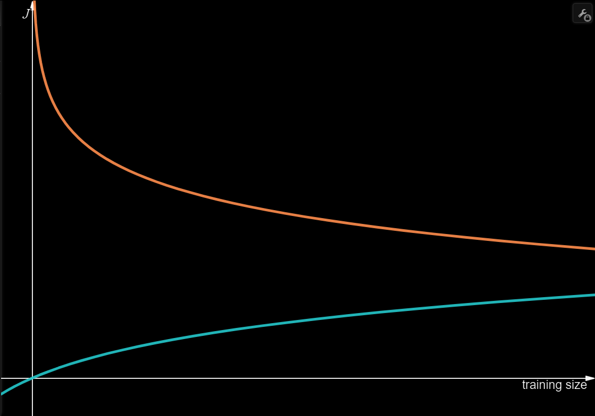
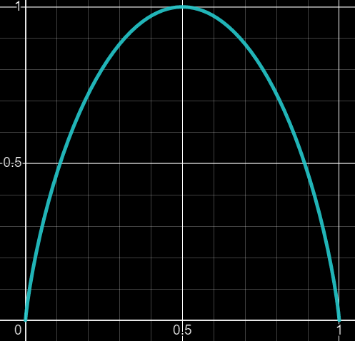

<!--
latex multiline:
   centered:
\begin{gather*}
   end-aligned:
\begin{align*}
 -->

# **Notes**

# Supervised Learning

## Gradient Cost Function:

Used to calculate the total error of the prediction model.

It is a convex function, which means it will always have one minimum point (which is local and global). \
This is important, since a well tune greedy algorithm can only promise to get to a local minima, rather than global. \
Using this function assures the greedy learning algorithm will get to the global minima, as desired.

$$
\begin{gather*}
J = \frac{1}{2m} \cdot \sum_{i=1}^{m}{(\hat{y}^{(i)} - y^{(i)})^2} \\
\text{where:} \\
\text{m = y length, } \hat{y} \text{ = the predicted value}
\end{gather*}
$$

### Thoughts

#### The intuitive function to use (without consider the convex) is just using absolute delta:

$$
J = \frac{1}{2m} \cdot \sum_{i=1}^{m}{|\hat{y}^{(i)} - y^{(i)}|} \\
$$

I wonder what will happen, if used.\
Will this function be a convex function, if not, what can be done to it (not including the known squaring method).

#### Why divide by `2m`?

The cost function starts with $\ J = \frac{1}{2m} \cdot ...$ . \
Why divide by m? - this is obvious, since the sigma function just adds up all calculated squared differences, but in order to have some sort of universal and general measure to measure the error of a prediction function, it should not be related directly to the number of `y` instances, but to the true average error.

The `2` in the function is apparently just for convenience purposes (see the derivatives calculation in the [gradient descent algorithm](#gradient-descent-algorithm)).

#### Why not use the newton method?

The newton method for finding the point when a polynomial function meets the X axis (equal 0). \
The following (half) derivatives should equal 0, when the original cost function is at minimum:

$$
\begin{gather*}
\frac{d}{dw}\cdot J(\vec{w},  b) \\
\frac{d}{db}\cdot J(\vec{w},  b)
\end{gather*}
$$

Using newton's method will require to calculate the derivative of the (half-) derivative, and will not depend on alpha (and since that, it can bounce between 2 points only, for example):

$$
\begin{gather*}
f(\vec w) = \frac{d}{dw}\cdot J(\vec{w},  b) = \\
\frac{1}{m} \cdot \sum_{i=1}^{m}{(\vec{w} \cdot \vec{x}^{(i)} + b - y^{(i)}) \cdot \vec{x}^{(i)}} = 0 \\
\\
x_1 = x_0 - \frac{f(x_0)}{f'(x_0)} \\
\vec{w_1} = \vec{w_0} - \frac{f(\vec{w_0})}{f'(\vec{w_0})} = \\
\vec{w_0} - \frac{\frac{1}{m} \cdot \sum_{i=1}^{m}{(\vec{w}_0 \cdot \vec{x}^{(i)} + b - y^{(i)}) \cdot \vec{x}^{(i)}}}{\frac{1}{m} \cdot \sum_{i=1}^{m}{(\vec{x}^{(i)} + b - y^{(i)}) \cdot \vec{x}^{(i)}}} = \\
\vec{w_0} - \sum_{i=1}^{m}{\frac{(\vec{w}_0 \cdot \vec{x}^{(i)} + b - y^{(i)})}{(\vec{x}^{(i)} + b - y^{(i)})}}\\
\end{gather*}
$$

**A test is in order!**

#### The chosen formula uses the delta squared:

$$
J = \frac{1}{2m} \cdot\sum_{i=1}^{m}{(\hat{y}^{(i)} - y^{(i)})^2}
$$

But one property of a squaring numbers, is that:
(s = squared ; d = prediction\ delta)
s = d^2

$$
\begin{gather*}
\text{when }-1< d <1 \text{, then } s < |d| \\
\text{when }d < -1 \And d>1 \text{, then } s > |d| \\
\text{when }d=\pm1 \text{, then } s = |d|
\end{gather*}
$$

What I am wondering is that maybe, it has some impact on the learning algorithm, since it takes more seriously that
deltas that are bigger than 1. \
 Maybe it is another reason the data should be normalized -1...1 or 0...1, but i guess it does not assure that the
delta will also be in that range. \
 **Requires further investigation**

## Gradient Descent Algorithm

Used to (greedily) minimize the cost function (`J`), given vector `w` and number `b` to correspond to any sort of function f that uses for. for example (and the most basic but powerful), a linear function:

$$
f_{\vec{w}, b}(\vec{x}^{(i)} ) = \vec{w} \cdot \vec{x}^{(i)} + b
$$

Here is a simple non linear form of prediction function:

$$
f_{\vec{w}, b}(\vec{x}^{(i)} ) = w_1 {\vec{x}^{(i)}}^2 + w_2 \vec{x}^{(i)} + b
$$

Each iteration, it slightly changes `w` and `b`, based on the cost function `J(w, b)` and a learning step `alpha`:

$$
\begin{gather*}
\vec{w} = \vec{w} - \alpha \cdot \frac{d}{d\vec w}J(\vec{w}, b) \\
b = b - \alpha \cdot \frac{d}{db}J(\vec{w}, b)
\end{gather*}
$$

### Calculations

Let's calculate those derivatives (using the convex cost function `J` [mentioned earlier](#gradient-cost-function), and the [linear gradient descent](#gradient-descent-algorithm)):

$$
\begin{align*}
\frac{d}{d \vec w}J(\vec{w}, b) = \\
\frac{1}{2m} \cdot \frac{d}{d\vec w} \sum_{i=1}^{m}{(\hat{y}^{(i)} - y^{(i)})^2} = \\
\frac{1}{2m} \cdot \frac{d}{d\vec w} \sum_{i=1}^{m}{(f_{\vec{w}, b}(\vec{x}^{(i)} ) - y^{(i)})^2} = \\
\frac{1}{2m} \cdot \frac{d}{d\vec w} \sum_{i=1}^{m}{(\vec{w} \cdot \vec{x}^{(i)} + b - y^{(i)})^2} = \\
\frac{1}{2m} \cdot 2 \cdot \sum_{i=1}^{m}{(\vec{w} \cdot \vec{x}^{(i)} + b - y^{(i)}) \cdot \vec{x}^{(i)}} = \\
\frac{1}{m} \cdot \sum_{i=1}^{m}{(\vec{w} \cdot \vec{x}^{(i)} + b - y^{(i)}) \cdot \vec{x}^{(i)}} \\
\end{align*}
$$

And for `b`:

$$
\begin{align*}
\frac{d}{db}J(\vec{w}, b) = \\
\frac{1}{2m} \cdot \frac{d}{db} \sum_{i=1}^{m}{(\hat{y}^{(i)} - y^{(i)})^2} = \\
\frac{1}{2m} \cdot \frac{d}{db} \sum_{i=1}^{m}{(f_{\vec{w}, b}(\vec{x}^{(i)} ) - y^{(i)})^2} = \\
\frac{1}{2m} \cdot \frac{d}{db} \sum_{i=1}^{m}{(\vec{w} \cdot \vec{x}^{(i)} + b - y^{(i)})^2} = \\
\frac{1}{2m} \cdot 2 \cdot \sum_{i=1}^{m}{(\vec{w} \cdot \vec{x}^{(i)} + b - y^{(i)})} = \\
\frac{1}{m} \cdot \sum_{i=1}^{m}{(\vec{w} \cdot \vec{x}^{(i)} + b - y^{(i)})} \\
\end{align*}
$$

### Conclusion

To conclude, we have the following formulas for the greedy gradient descent algorithm:

$$
\begin{gather*}
w = w- \frac{\alpha}{m} \cdot \sum_{i=1}^{m}{(\vec{w} \cdot \vec{x}^{(i)} + b - y^{(i)}) \cdot \vec{x}^{(i)}} \\
b = b- \frac{\alpha}{m} \cdot \sum_{i=1}^{m}{(\vec{w} \cdot \vec{x}^{(i)} + b - y^{(i)})} \\
\end{gather*}
$$

## Logistic Regression

Used to predict an output value that is not a number(which can be any real number), but a category. \
Also called "Classification".

### Sigmoid function

The sigmoid function is used to convert a real number to a number between 0 and 1 (where big positive numbers are close to 1, and big negative numbers are close to 0). \
It is used in the logistic regression algorithm, to convert the prediction function to a probability.

$$
\sigma(z) = \frac{1}{1+e^{-z}}
$$

### Binary classification

The logistic regression algorithm is used to predict a binary value (0 or 1). \
It is based on the sigmoid function to convert the prediction function to a probability weather the inputs are in the category 1 or 0. \
Here is an example of a linear based prediction function:

$$
\begin{gather*}
\hat{y} = \sigma(\vec{w} \cdot \vec x + b) = \frac{1}{1+e^{-(\vec{w} \cdot \vec x + b)}}
\end{gather*}
$$

### Classification cost function

If the linear gradient descent cost function is used (chained with the sigmoid function), it will not work, because the cost function is not convex. \
The cost function is not convex because it has a local minimum, and a global minimum. \
(The local minimum is the minimum of the cost function, when the prediction function is 0. The global minimum is the minimum of the cost function, when the prediction function is 1.) \
Therefore we need to use a different cost function, that is convex. \
Here is an example of a convex cost function:

$$
\begin{gather*}
\text{note: } \hat{y} = \sigma[f_{\vec{w},  b}(\vec{x}^{(i)})] \\
\\
if \; y = 1 \text{ then: } L(\vec{w}, b) = -\log(\hat{y}) \\
if \; y = 0 \text{ then: } L(\vec{w}, b) = -\log(1-\hat{y}) \\
\text{or, in one line: } \\
L(\vec{w}, b) = -y \cdot \log(\hat{y}) - (1-y) \cdot \log(1-\hat{y}) \\
J(\vec{w}, b) = \frac{1}{m} \cdot \sum_{i=1}^{m}{L(\vec{w}, b)}
\end{gather*}
$$

#### Calculations

$$
\begin{align*}
\frac{d}{d\vec w}J(\vec{w}, b) = \\
\frac{1}{m} \cdot \frac{d}{d\vec w} \sum_{i=1}^{m}{L(\vec{w}, b)} = \\
\frac{1}{m} \cdot \sum_{i=1}^{m}{\frac{d}{d\vec w} L(\vec{w}, b)} = \\
\frac{1}{m} \cdot \sum_{i=1}^{m}{\frac{d}{d\vec w} -y \cdot \log(\hat{y}) - (1-y) \cdot \log(1-\hat{y})} = \\
\frac{1}{m} \cdot \sum_{i=1}^{m}{\frac{d}{d\vec w} -y \cdot \log(\sigma(\vec{w} \cdot \vec{x}^{(i)} + b)) - (1-y) \cdot \log(1-\sigma(\vec{w} \cdot \vec{x}^{(i)} + b))} = \\
\frac{1}{m} \cdot \sum_{i=1}^{m}{\frac{d}{d\vec w} -y \cdot \log(\frac{1}{1+e^{-(\vec{w} \cdot \vec{x}^{(i)} + b)}}) - (1-y) \cdot \log(1-\frac{1}{1+e^{-(\vec{w} \cdot \vec{x}^{(i)} + b)}})}
\end{align*}
$$

### Thoughts

#### How to implement multiple classes?

Till now, we have only implemented the logistic regression algorithm for binary classification. \
But what about multiple classes?

One way is to use multiple logistic regression algorithms. \
For example, if we want to predict 3 classes, we can use 3 logistic regression algorithms, and use the one with the highest probability.

Another way is to change the math, and maybe make as an output an array of probabilities (it appears that it's called "Softmax Regression", I am a genius).

### Softmax function

The softmax function is used to convert a vector of numbers to a vector of probabilities. \
It is used in the multi-class logistic regression algorithm, to convert the prediction function to a probability.

$$
\begin{gather*}
\sigma(\vec z) = \frac{e^{\vec z}}{\sum_{i=1}^{n}{e^{z_i}}} \\
\end{gather*}
$$

How does it work? \
The softmax function takes a vector of numbers, and converts it to a vector of probabilities. \
The probabilities are calculated by dividing each number by the sum of all numbers. \
The sum of all probabilities is 1.

Why the power of e? \
The intuitive way would be to divide each number by the sum of all numbers, like this:

$$
\sigma(\vec z) = \frac{\vec z}{\sum_{i=1}^{n}{z_i}}
$$

This method would maybe make the sum of all probabilities 1, but (in negative numbers) it would make the probabilities negative and bigger than 1. \
The power of e makes the probabilities positive and smaller than 1. \
And it maybe also better for optimizing the cost function.

### ReLU function

The ReLU function is a different activation function (along with the sigmoid function and the linear function(or "no function")). \
It is used for neural networks, and it is faster to compute than the sigmoid function. \
Another advantage is that it does not have flat gradients at the edges, like the sigmoid function does, which makes it faster to optimize the cost function.

$$
\sigma(\vec z) = \max(0, \vec z) \\
$$

> Note: In neural networks, if all the activation functions are linear, then the neural network is just a linear regression algorithm.
> This is where the ReLU function comes in, because it is a non-linear (but still fast to compute) activation function.

## Regularized Cost Function

Used to prevent overfitting. The regularization term is added to the cost function. \
It simply adds cost to the model for having large weights. \
The common symbol for the regularization term is `lambda`.

$$
\begin{gather*}
J_R(\vec{w},  b) = J(\vec{w},  b) + \frac{\lambda}{2m} \cdot \sum_{j=1}^{n}{w_j^2} \\
\\
w = w - \alpha \cdot \frac{d}{dw} J(\vec{w},  b) \\
w = w - \alpha \cdot \frac{1}{m} \cdot \sum_{i=1}^{m}{ -y \cdot \sigma(\vec{w} \cdot \vec{x}^{(i)} + b) \cdot \vec{x}^{(i)}} + \frac{\lambda}{m} \cdot w
\end{gather*}
$$

Usually, the regularization term is only added to the weights, not the bias.

## Analyzing and Improving the Model

Generally, after defining the problem and splitting the data, the ML development cycle is choose a model, train it, and test it.

### Test and Train sets

It is common to split the data into a test set and a train set. \
Additionally, it is common to split the train set into a train set and a cross validation set. \
Only the train set is used to train the model. \
The cross validation set is used to optimize the model. \
For example, to find the best activation function, or the best regularization term f(w, b). \
While the test set should not be used to optimize the model, it is used to see how well the model performs on data it has not seen before.

$$
\begin{gather*}
J_{train}(\vec{w},  b) = \frac{1}{m_{train}} \cdot \sum_{i=1}^{m_{train}}{L(\vec{w}, b)} \\
J_{cv}(\vec{w},  b) = \frac{1}{m_{cv}} \cdot \sum_{i=1}^{m_{cv}}{L(\vec{w}, b)} \\
J_{test}(\vec{w},  b) = \frac{1}{m_{test}} \cdot \sum_{i=1}^{m_{test}}{L(\vec{w}, b)} \\
\end{gather*}
$$

One note about the test set: \
When looking at the success percentage of the model on the test set, sometimes it should not be compared to 100% success, but rather to the success percentage of humans(where relevant), of competitors and of prior models.

### Detecting underfitting and overfitting

#### Underfitting

Underfitting (also called `bias`) is where `J_train` is high (and `J_cv` is also high). \
Generally, this means that the model is not complex enough to fit the data.

Solutions:

- decrease regularization term `lambda`.
- increase number of features.
- use different activation function.
- use higher order polynomial function (or other more complex functions).
- (in neural networks) increase number of (hidden) layers.
- (in neural networks) increase number of neurons in each layer.

#### Overfitting

Overfitting (also class `variance`) is where `J_cv` is high ( and `J_train` is low). \
Generally, this means that the model is too complex, and it fits the train set so well that it does not generalize well.

Solutions:

- increase regularization term `lambda`.
- decrease number of features.
- use different activation function.
- use lower order polynomial function (or other less complex functions).
- get more data (especially in neural networks).

#### Both

Another but more rare case is where `J_train` is high, and `J_cv` is much higher. \
It means that there is high bias(underfitting) and high variance(overfitting).

### Learning Curves

Learning curves are used to detect underfitting and overfitting. \
They are graphs of `J_train` and `J_cv` as a function of the number of training examples. \
Both curves will flatten out at some point, and they look like this:

(the blue line is `J_train`, the orange line is `J_cv`)

The learning curves can be used to analyze and improve the model. \
The following are some rules of thumb:

1. If the actual learning curves are not flattening out, then it means more data is needed.

2. If the gap between the two curves is large, then it means the model is overfitting, and more data would not help(at least not in the current state of the model). \
   In this case, the model should be improved, with the solutions mentioned above to deal with overfitting.

3. If the gap between the two curves is small, then it means the model is very good.

## Understanding and Analyzing the Data

### Generalized vs. Specific Models and Error Analysis

It is tempting to try to reach a generalized model that fit all cases, but sometimes a more specifics model that solves a large enough part of the problem is better. \
This is also connected, more generally, to error analysis. \
Sometimes, the goal of the model is to identify a set of cases, where some cases are more important or more common than others. \
When starting to develop the model, it is important to understand the problem and the data, and to understand what the model should do, in order to detect such case, and maybe to develop a more specific model.

### Adding Data

Sometimes, it is possible to generate more data from the existing data, by augmenting the data. \
For example, if the data is images, then it is possible to rotate the images, or to add noise to the images. \
This can be done by using the existing data, and by applying some transformations to it. \
Another example is to add a variety of background noise to audio data, when developing a speech recognition model.

Another way to generate data is to synthesize data. \
For example, when developing a OCR model, it is possible to synthesize data by using a font generator, and then using the generated images as data. \
This technique can also be combine with data augmentation, to add noise to the generated images.

### Fairness of the Model

When developing a model, it is important to consider potential bias in the data. \
For example, bias in the data against certain genders or ethnicity groups. \
It is important to consider such bias, and to try to remove it from the data, or to make sure that the model is not biased against such groups.

A good practice is to always have a fallback version of the model, that is not biased, and that can be used in case of bias in the data or in the model is detected.

### Transfer Learning

Transfer learning is a technique that can be used to improve the performance of a model, especially when the data is small. \
It is used in neural network, where the new model is a relatively specific model under the same type and field of data the original model was trained on. \
Usually, the original model is trained on a very large dataset. \
The technique is based on the idea that there are common features and patterns in the data, and that the original model has already learned them. \
The new model just copies all the layers of the original model, except the last layer(the output layer). \
Then, the model is trained with its specific data (while sometime, especially when the data is very small, only the last layer of the model is being modified and trained). \
A good example for that is a model for identifying digits for images, that would use a large image model.

### Skewed Datasets and Precision-Recall tradeoff

When the data is skewed, meaning that there are more examples of one class than the other, a simple function that just prints the common output- will have better bias and variance metrics than a trained model. \
Therefore, other metrics should be used to evaluate the model.

Precision and recall are two metrics that are used to evaluate the performance of a model. \
They are used in binary classification, where the model is trained to predict one of two classes. \
Precision is the ratio of true positives to all positives. \
Recall is the ratio of true positives to true positives and false negatives. \
(might be called anti-recall, since the higher the better).

$$
\begin{gather*}
Precision = \frac{true\ positive}{true\ positive + false\ positive} \\
Recall = \frac{true\ positive}{true\ positive + false\ negative}
\end{gather*}
$$

In these cases, one can produce some models that have different precision and recall values, but non of them is better at both that the others. \
Therefore, it is common to use the F1 score, which is the harmonic average of precision and recall, and with the combined metric, one can choose the best model. \
The harmonic average is used, because it is more sensitive to the lower values (the output of the function is closer to the lower value).

$$
F1 = \frac{2}{\frac{1}{Precision} + \frac{1}{Recall}} = \frac{2 * Precision * Recall}{Precision + Recall}
$$

## Decision Trees

General idea: \
A decision tree is a model that is used to classify data. \
It is a tree-like structure, where at each node, the data is split into two groups, according to some condition (usually a feature value is compared to a threshold).

The tree is built recursively, by splitting the data at each node, until the data is split into two groups that are pure (all the data in each group is of the same class). \
The tree is built by using a cost function, that is minimized at each node. \
The cost function is usually the entropy of the data, and the split is done by minimizing the entropy of the data. \
The tree is built by using a greedy algorithm, that chooses the split that minimizes the entropy at each node.

### Entropy Optimization

### When to stop splitting?

There are several approaches to when to stop splitting the data, to avoid overfitting and overcomplicating the model (more than one approach can be used concurrently):

1. when the node is pure (meaning the node is 100% one class, or very close to it).
2. when the node has a small number of examples.
3. when splitting the node will not improve the model significantly enough.
4. when the node has reached a certain maximum depth.

### Entropy and Information Gain

Entropy is a measure of the randomness of the data. \
It is used to measure the impurity of the data, and to measure the information gain of a split. \
The entropy is a function of the probability distribution of the data, and it is defined as:

$$
\begin{gather*}
H(p) = -p\cdot log_2(p) - (1-p)\cdot log_2(1-p) \\
H(\vec p) = -\sum_{i=1}^n p_i\cdot log_2(p_i)
\end{gather*}
$$

Which looks like this:

In practice, a weighted entropy is used, where the weights are the number of examples in each class. \
Additionally,the new potential entropies are subtracted from the parent weighted entropy, to get the information gain of the split (= the reduction in entropy).

$$
\begin{gather*}
IG = H(parent) - \frac{N_{left}}{N_{parent}}\cdot H(left) - \frac{N_{right}}{N_{parent}}\cdot H(right)
\end{gather*}
$$

According to the information gain, the split that maximizes the information gain is chosen, or it is decided to stop splitting the data (when the information gain is not significant enough).

### One Hot Encoding

One hot encoding is a technique that is used to encode categorical data. \
It is used when the data is categorical, and there are more than two categories. \
The technique is used to convert the categorical data to numerical data, by creating a new feature for each category, and setting the value of the feature to 1 if the example is in that category, and 0 otherwise. \
For example, if the data is either: red, green or blue- the color feature will be replaced with three new features: is_red, is_green and is_blue. \
This technique can be used in decision trees and neural networks.

### Decision Trees in Regression

Decision trees can also be used for regression, by using the mean of the data in each leaf as the prediction. \
Instead of minimizing the entropy, in regression, the variance of the data in each leaf is minimized. \
The variance is a measure of the spread of the data, and it is defined as:

$$
Variance(\vec x) = \frac{1}{n}\sum_{i=1}^n (x_i - \bar x)^2
$$

> Note: that this method would never predict a value that is not in the training data, and therefore, it is suitable for data that this is not a problem.

### Tree Ensembles

Decision trees have some disadvantages, such as overfitting, and low accuracy. \
These problems are the result of the significant influence of the few top most decision nodes, and the fact that the model is very sensitive to any change in the data.

To overcome these problems, there is a technique called tree ensembles. \
Tree ensembles is used to improve the performance, by combining several decision trees, and using the output of all of them to make the final prediction (in a democratic way). \
There are several methods for combining the trees, and some common one will be discussed in the following sections.

#### Random Forest

Random forest means building tress by using a random subset of the data (and sometimes a random subset of the features). \
The random subset of the data is used to reduce the correlation between the trees (and the random subset of the features is used to reduce the correlation between the features in each tree).

#### Gradient Boosting

Gradient boosting is a technique that is used to combine several decision trees, by building each tree to correct the errors of the previous tree. \
The first tree is built on the original data, and each subsequent tree is built on the errors of the previous tree. \
The new tree gives more attention to the misclassified examples, using higher probabilities to "bag" them (put them in the training set), or using higher weights to train them.

Common open source implementations of gradient boosting is XGBoost, which have both classifiers and regressors.

### Decision Trees vs Neural Networks

Properties of decision trees:

- Works well on tabular(structured) data, but not recommended for unstructured data(images, audio, text etc.).
- Fast to train, and fast to predict. (can make the whole development cycle faster).
- Easily interpreted by humans (but not so much when it comes to tree ensembles and very deep trees).

Properties of neural networks:

- Works well on all kinds of data (including unstructured data).
- Slower to train.
- Works with transfer learning(not possible with decision trees).
- When building a system of multiple NN models, it can be easier to string them together (for training and prediction).

### Thoughts about Decision Trees

1. Why not combine the last nodes of decision trees to another small model? \
   It seem logical to reduce entropy, and then make separate models for each leaf (for large and complex data).
2. Moreover, many combination of all the models types can be explored.

# Unsupervised Learning

Generally, while supervised learning is used to predict a label y given the input data X, which makes the model inherently, at best, as good as than the supervisor(s) that produced the labels (usually humans), unsupervised learning is used to find patterns in the data, without any labels, and therefore, theoretically, the model can do better than the any supervisor(s), because it is not limited by the quality or the existence of the labels.

## Clustering and K-Means

Clustering is a technique that is used to group the data into clusters, based on the similarity of the data. \
The similarity is usually measured by the distance between the data points, and the clustering is done by minimizing the distance between the data points in the same cluster, and maximizing the distance between the data points in different clusters.

### K-Means Algorithm

K-means clustering is a technique that is used to cluster the data into k clusters, by minimizing the distance between the data points in the same cluster, and maximizing the distance between the data points in different clusters. \
`K` sample are chosen randomly from the data `X`, which will represent the center of each clouter, and are called centroids.
Then, each iteration is as follows:

1. Each data point is assign to the closest centroid.
2. Each centroid is update to be the means of the data points that were assigned to it.

Repeat the process until the centroids do not change, or they do not change significantly enough.

Notice, that there might be a case where a centroid will have 0 assigned points. \
In this case, it is common to just drop this centroid (this will result in K-1 clusters), or less commonly to reinitialize its values randomly.

### K-Means Cost Function

The (hidden) cost function that the K-Means algorithm tries to minimize is the sum of the distance between each centroid and its assign data points, squared(squared for each distance, not the total).

$$
J(\vec c, \vec \mu) = \frac{1}{m} \sum_{i=1}^{m}{{||x^{(i)} - \mu_{c^{(i)}} ||}^2}
$$

### Initializing Centroid

It is common to choose random data points from the actual X data as initial values for centroids. \
Those initial values of the centroids can have large impact on the result of the clustering algorithm. \
Because of that, it is common to repeat the algorithm for a reasonable number (each time randomizing the initial centroids values) and select the one which got to the minimized cost.

#### Thoughts

Maybe there is another property that can be pre-calculated to select the best resulting initial centroids values. \
Like, the `K` data points that are the farthest from each other, or maybe the closest, or another parameter?

### Choosing the number K

By logic, `K` most be smaller than `m`(the `X` data points count). \
But, it is also logical that the bigger `K` is, the lower the cost function `J` will be. \
Therefore, one cannot optimize the value `k` just be looking for the lowest cost outcome.

One method to address this is called Elbow Method, which when the graph of the cost function `J` as a function of `K` looks like a partially folded arm. \
Meaning, a high slope at the beginning, that flattens very quickly at a certain point (the elbow), and this elbow point is the optimal `K` value.

But not always there is such elbow, therefore another method is to just check how good each model is, based on its desired use case, on its downstream purpose.

## Anomaly Detection

Anomaly detection is a technique that is used to detect outliers in the data. \
An outlier is a data point that is very different from the rest of the data. \
Anomaly detection is used to detect fraud, mal-manufactured and malfunctioning objects and systems.

### Gaussian Distribution

Anomaly detection is done by using a Gaussian distribution to model the data, and then, by using the probability density function of the Gaussian distribution, to calculate the probability of each data point, and then, by using a threshold, to detect the outliers.

The Gaussian distribution is a continuous probability distribution, that is used to model the data. \
The Gaussian distribution is defined by two parameters: the mean and the variance. \
The mean is the average of the data, and the variance is the average of the squared distance of the data from the mean. \\
Then the probability is compared to `epsilon`.

$$
\begin{gather*}
\mu = \frac{1}{m} \sum_{i=1}^{m}x^{(i)} \\
% \vec \mu = \frac{1}{m} \sum_{i=1}^{m}\vec x^{(i)} \\
\sigma^2 = \frac{1}{m} \sum_{i=1}^{m}{{(x^{(i)} - \mu)}^2} \\
% \vec \sigma^2 = \frac{1}{m} \sum_{i=1}^{m}{{(\vec x^{(i)} - \vec \mu)}^2} \\
p(x) = \frac{1}{\sqrt{2\pi\sigma^2}} e^{-\frac{(x - \mu)^2}{2\sigma^2}} \\
p(\vec x) = \prod_{j=1}^{n}{p(x_j; \mu_j, {\sigma_j}^2)} \\
\end{gather*}
$$

To solve for vector `X`, since the features are statistically independent(although it works well also when some are not), the combine probability is the multiplication all the feature probabilities.

### Develop and Evaluate Anomaly Detection Model

A cross-validation and a test set which include common samples as well as a some anomalous samples, can be compared with the result of the model (whether the probability is lower than `epsilon`).\
(If the dataset is small, it is common to use only a cross validation set, with the risk of overfitting). \
Additionally, the metrics mentioned in [skewed datasets and precision recall tradeoff](#skewed-datasets-and-precision-recall-tradeoff).

When the model detects a false positive anomaly, it can usually be fixed by detecting what features are missing from the data that make the anomaly an anomaly.

### Anomaly Detection vs Supervised Learning

Anomaly Detection are better when there are small amount of anomalous samples, and where the future anomalies may look very differently, compared to the sampled ones. \
While Supervised Learning will not identify any anomaly "type" that is not sampled.

### Non Gaussian Features

When the features are not Gaussian, it is common to use a transformation to make them Gaussian, and then use the Gaussian distribution to model the data. \
Common transformation are a log function and square root transformation(or any power of a number). \
(There are some automated methods to evaluate how close a feature set is to gaussian graph).

## Recommender Systems

In general, recommender systems are used to recommend items to users, based on data.

### Collaborative Filtering

Collaborative filtering uses some data about the users and items, and then, based on the similarity between users and items, it recommends items to users.

Data example:

| Item   | User 1 Rating (y) | User 2 Rating (y) | User 3 Rating (y) | X_1 | X_2 |
| ------ | ----------------- | ----------------- | ----------------- | --- | --- |
| Item 1 | 5                 | 4                 | 0                 | 1   | 1   |
| Item 2 | 3                 | 0                 | 4                 | 1   | 0   |
| Item 3 | 4                 | 3                 | 0                 | 1   | 1   |
| Item 4 | 3                 | ?                 | 5                 | 1   | 0   |
| Item 5 | 1                 | 5                 | 4                 | 0   | 1   |

The `X_1` and `X_2` are the features of the items, and the `User 1 Rating` and `User 2 Rating` are the features of the users. \
The `?` represents that the user did not rate the item, and it can be predicted using the user's weights which correspond to the item's features. \
`r(i,j)` is a function that return 1 if user `j` has rated item `i`.

Related items can be found by the closest `X` value items to a given item:

$$
\text{min D} \\
D(x^{(k)}, x^{(i)}) = \sum_{f=1}^{features\_count}{(x_f^{(k)} - x_f^{(i)})^2} \\
= || x^{(k)} - x^{(i)} ||
$$

#### Collaborative Filtering Algorithm

The cost function of `W`, `J` given `X` and `Y` (the same for cost of `X` given `Y` and `W`, just with another regularization term. obviously):

$$
\frac{1}{2}\sum_{j=1}^{users\_count}{\sum_{i:r(i,j)=1}{(w^{(j)}\cdot x^{(i)} + b^{(j)} - y^{(i,j)})^2}} + \text{regularization term...}
$$

So the collaborative cost function is:

$$
J(w, b, x) = \frac{1}{2} \sum_{(i,j):r(i,j)=1}{(w^{(j)}\cdot x^{(i)} + b^{(j)} - y^{(i,j)})^2}
$$

These technique can be used also with binary labels, using the sigmoid activation function.

#### Cons of Collaborative Filtering

A down side about recommendation systems, more generally, is that they can get very computationally expensive, as the data grows (and some technique to face that will be discussed later). \
But it is very bad with new data: new users and new items. \
Do face it a little, mean normalization can be used (usually on item, rather than on users) to make that average (=default) value the mean, and not 0 (since the regularization term attracts the weights to 0).

To address this, there is another technique called [content based recommendation](#content-based-recommendations).

### Content Based Recommendations

Content based recommendations use the features of the items, and the features of the users, to recommend items to users. \
It requires some data about the items (`X_m`) and users (`X_u`), and based on them generate two vector of the same length `v_m` and `v_u` where the dot product of them is the predicted rating of the user for the item, and the similarity distance can be based on them. \
For example, user data can be location, browser, and time of day, and item data can be genre, director, actor and rating.

Usually, thee vectors are generated by a neural network(one for items and one for users, combine to dot product) , and the cost function is:

$$
\begin{gather*}
J(v_m, v_u) = \sum_{(i,j):r(i,j)=1}{(v_m^{(i)}\cdot v_u^{(j)} - y^{(i,j)})^2} + \text{regularization term...} \\
\\
D(v_m^{(i)}, v_u^{(k)}) = || v_m^{(i)} - v^{(k)} ||
\end{gather*}
$$

#### Retrieval and Ranking - Scaling Content Based Recommendations

The item vectors can be computed ahead of time, as they are added to the system. \
The `k` most similar items can also be computed ahead of time (can be refreshed from time to time, to include the new items that were added).

But recommending items to users can be very expensive, when there are a lot of items, since the predicted rating needs to be evaluated to every item (and for each user). \
To address this, a process of retrieval and ranking can be used. \
The retrieval process is to filter only items that have high probability of being relevant to the user, and then rank them by their similarity to the user. \
The retrieval process can be getting the `k` last items that the user interacted with, and `k` top items of the user's `k` favorite genres, and maybe `k` top items of the user's country and so on. \
In the ranking process, the selected items are ranked by the predicted user rating, and the top `k` items are recommended to the user. \
Sometimes, the ranked list is filtered again, to remove duplicates or items that the user has already interacted with, for example.

### Ethics

The lecturer points out that these systems can have a negative impact on society, and can be used to manipulate people. \
For example, the recommendation system of social networks can encourage hate talk, and the recommendation system of online stores can recommend products that are more profitable and not the best deal for the user, without the user knowing it.

### Thoughts:

#### Why not both?

It seem there are valid advantages to content based recommendation, especially the fact that it works "from first sight". \
But collaborative filtering has some magic in it: it is like a collaborative neural network that learns from all the users, and creates a well tuned parameters for each items. \
I am wondering maybe the two models can be combined. \
I see one option to be to inject the collaborative filtering item categories into the `X_m` vector and the user weights into the `X_u` vector, and then use the content based recommendation algorithm.

## Visualize Data and PCA algorithm

When dealing with a lot of features (say 20), it is hard to visualize the data. \
One way to deal with it is to use PCA (Principal Component Analysis) to reduce the number of features to 2 or 3, and then visualize the data. \
The generated 2d or 3d graphs are much easier for humans to understand.

### PCA Algorithm

PCA is an algorithm that finds the direction of maximum variance in the data, and then projects the data onto that direction. \
It is somewhat similar the gradient descent algorithm, but instead of minimizing delta y, it is minimizing the distance between the data and the projection line. \
The projection line is the line that is perpendicular to the direction of maximum variance (when the data is spread the most). \
Each projection line is orthogonal (dimension-perpendicular) to the previous one, and the first projection line is the direction of maximum variance.

#### Historical usage of the PCA Algorithm

In the past, PCA was used to several things:

- Reduce computational cost of NN training
- Compress (lossy) data

## Reinforcement Learning
